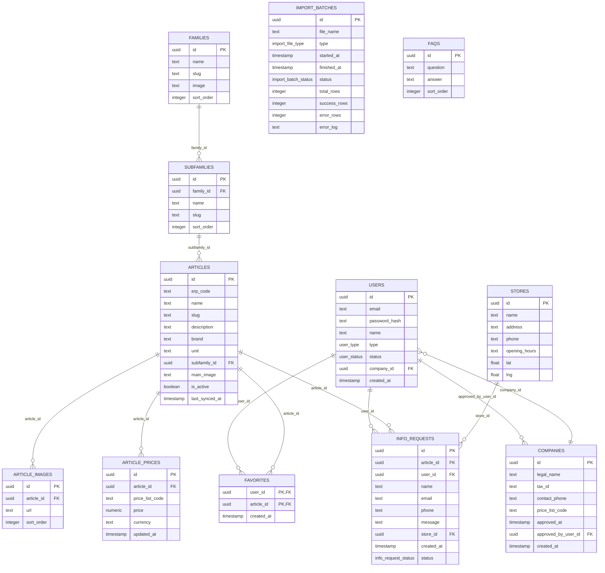

# ERD

## Notas

- `erp_code` es la clave de negocio única del ERP.
- `price_list_code` admite `PUBLIC` y cualquier tarifa B2B aprobada.
- `info_requests` almacena consultas de producto y de contacto general.
- `import_batches.error_log` queda como texto serializado para simplificar auditoría inicial.
